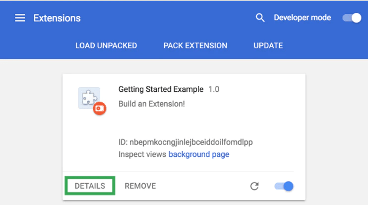
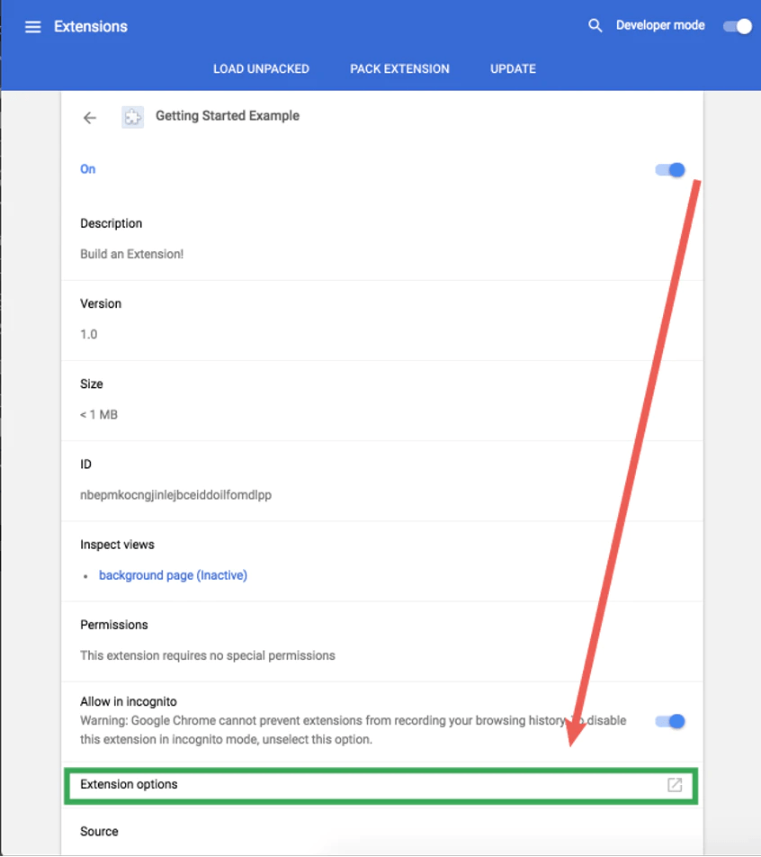
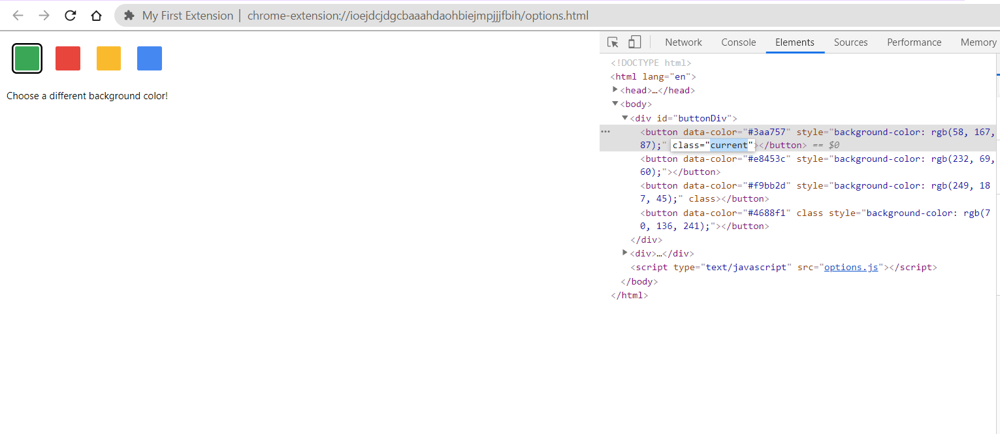

#### Steps to Create
- Extensions start with their manifest. Create a file called manifest.json and include the following code.
    ```
    {
      "name": "Getting Started Example",
      "description": "Build an Extension!",
      "version": "1.0",
      "manifest_version": 3
    }
    ```
- The directory holding the manifest file can be added as an extension in developer mode in its current state.

- Opening app in chrome
 - Open the Extension Management page by navigating to chrome://extensions.
   - Alternatively, open this page by clicking on the Extensions menu button and selecting Manage Extensions at the bottom of the menu.
   - Alternatively, open this page by clicking on the Chrome menu, hovering over More Tools then selecting Extensions
 - Enable Developer Mode by clicking the toggle switch next to Developer mode.
 - Click the Load unpacked button and select the extension directory.

#### Add functionality
1. This extension will need information from a persistent variable as soon as its installed.
2. Start by including a listening event for runtime.onInstalled in the background script.
3. Inside the onInstalled listener, the extension will set a value using the storage API.
4. This will allow multiple extension components to access that value and update it.
    ```
        let color = '#3aa757';
        chrome.runtime.onInstalled.addListener(() => {
          chrome.storage.sync.set({ color });
          console.log('Default background color set to %cgreen', `color: ${color}`);
        });
    ```

#### Setting Permission
- ```
      {
        "name": "Getting Started Example",
        "description": "Build an Extension!",
        "version": "1.0",
        "manifest_version": 3,
        "background": {
          "service_worker": "background.js"
        },
        "permissions": ["storage"]
      }     
  ```


#### Adding popup html page
1.Create html file [We can also add external the css files]
2.Add it in manifest.js
 -  ```
    "action": {
            "default_popup" : "popup.html"
            }
    ```

    
#### Adding Icons
1. Add the icons directory under the extension directory
2. Add it in action field 
- ```
      "action": {
      "default_popup": "popup.html",
      "default_icon": {
        "16": "/images/get_started16.png",
        "32": "/images/get_started32.png",
        "48": "/images/get_started48.png",
        "128": "/images/get_started128.png"
      }
     }
  ```

#### App Icon
- ```
  "icons": {
      "16": "/images/get_started16.png",
      "32": "/images/get_started32.png",
      "48": "/images/get_started48.png",
      "128": "/images/get_started128.png"
    }
  ```

#### Adding Events
- ```javascript
  // When the button is clicked, inject setPageBackgroundColor into current page
  changeColor.addEventListener("click", async () => {
    let [tab] = await chrome.tabs.query({ active: true, currentWindow: true });
  
    chrome.scripting.executeScript({
      target: { tabId: tab.id },
      function: setPageBackgroundColor,
    });
  });
  
  // The body of this function will be executed as a content script inside the
  // current page
  function setPageBackgroundColor() {
    chrome.storage.sync.get("color", ({ color }) => {
      document.body.style.backgroundColor = color;
    });
  }
  ```

The manifest will need the activeTab permission to allow the extension temporary access to the current page, and the scripting permission to use the Scripting API's executeScript method
- ```javascript
  {
    "name": "Getting Started Example",
    ...
    "permissions": ["storage", "activeTab", "scripting"],
    ...
  }
  ```

#### Adding user options
Including an options page gives users more control over the extension's functionality, further customizing their browsing experience.
- `options.html`
  ```html
    <!DOCTYPE html>
    <html>
      <head>
        <link rel="stylesheet" href="button.css">
      </head>
      <body>
        <div id="buttonDiv">
        </div>
        <div>
          <p>Choose a different background color!</p>
        </div>
      </body>
      <script src="options.js"></script>
    </html>
    ```
- Then register the options page in the manifest,
    ```javascript
    {
      "name": "Getting Started Example",
      ...
      "options_page": "options.html"
    }
    ```



- `options.js`
    ```javascript
    let page = document.getElementById("buttonDiv");
    let  selectedClassName = "current";
    const presetButtonColors = ["#3aa757", "#e8453c", "#f9bb2d", "#4688f1"];
    
    function handleButtonClick(event) {
        let current = event.target.parentElement.querySelector(
            `.${selectedClassName}`
        );
    
        console.log('Immediate previous/parent element',event.target.parentElement.querySelector(
            `.${selectedClassName}`));
        console.log('current event.target.parentElement.querySelector()', current)
        console.log('Event target',event.target);
        console.log(current !== event.target)
        console.log('classList',current.classList)
        console.log('dataset',event.target.dataset)
        if (current && current !== event.target){
            current.classList.remove(selectedClassName)
        }
    
        let color = event.target.dataset.color;
        event.target.classList.add(selectedClassName);
        chrome.storage.sync.set({color});
    }
    
    function constructOptions(buttonColors) {
        chrome.storage.sync.get("color", (data) =>{
            let currentColor = data.color;
    
            for (let buttonColor of buttonColors){
                let  button = document.createElement("button");
                button.dataset.color = buttonColor;
                button.style.backgroundColor = buttonColor;
                if (buttonColor === currentColor){
                    button.classList.add(selectedClassName)
                }
                button.addEventListener("click", handleButtonClick);
                page.appendChild(button);
            }
        })
    
    }
    
    constructOptions(presetButtonColors);
    ```


